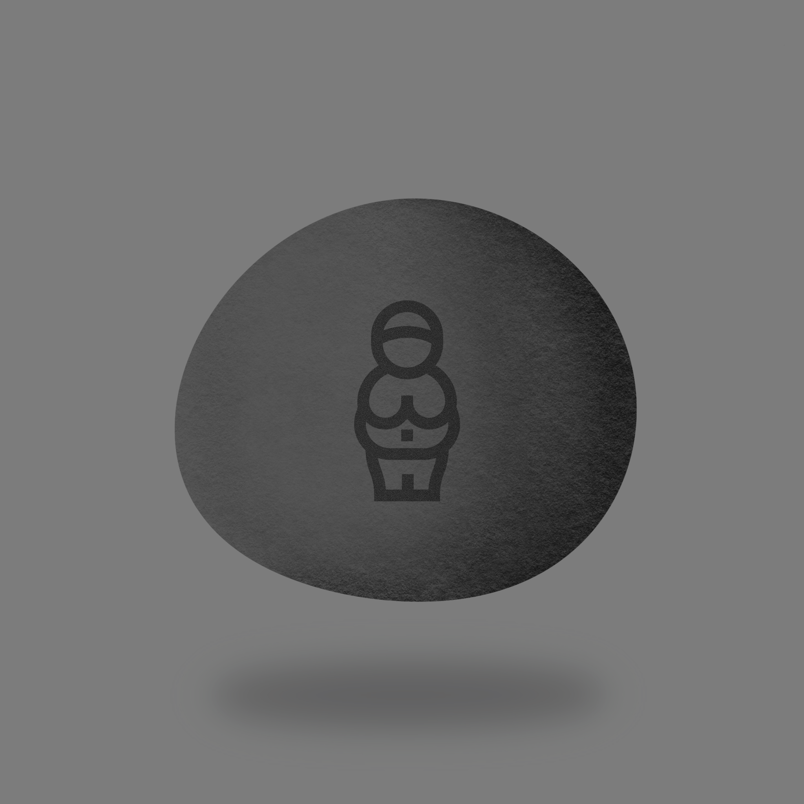
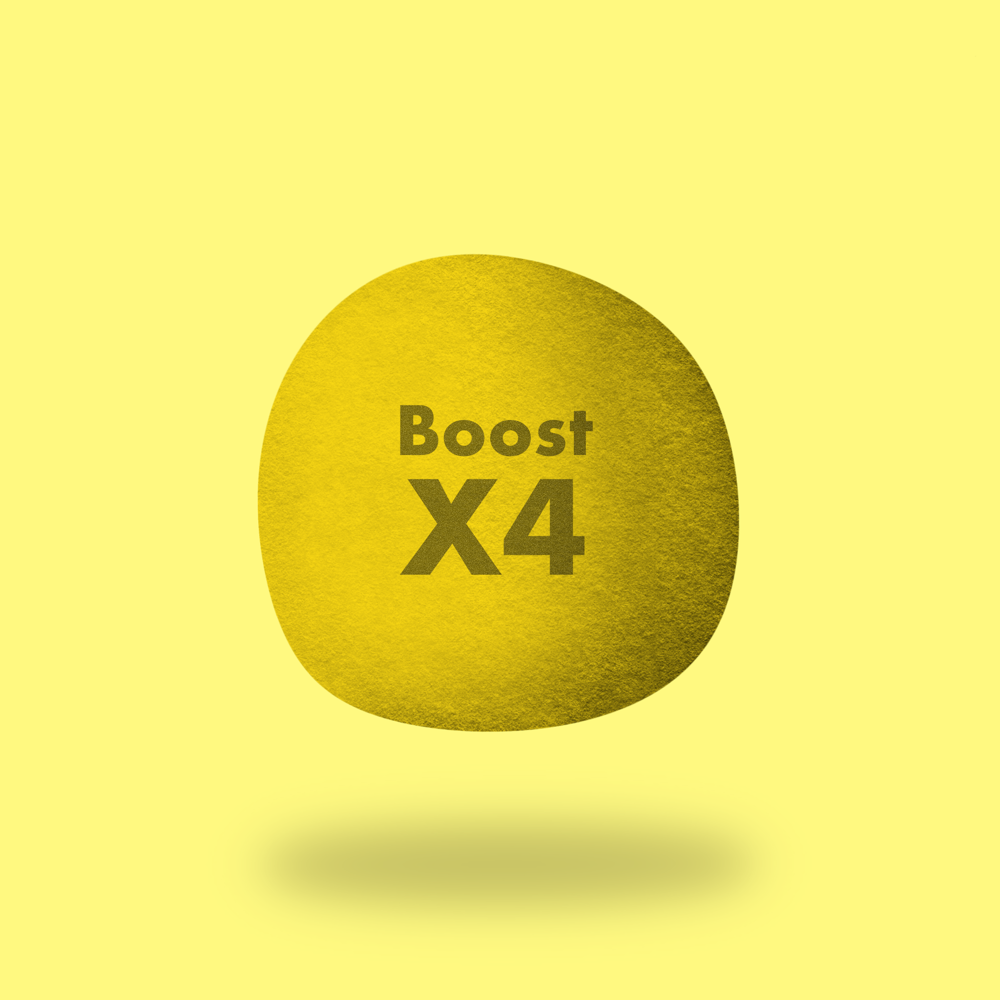
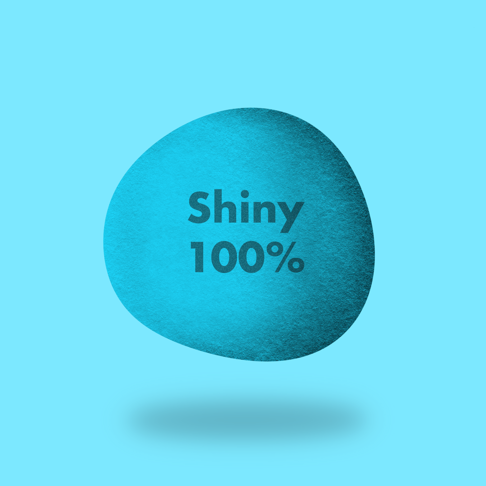

## What we mean by "Breeding"

Skullkraken(SK) + Skullkraken(SK) = Baby(BB)

- Cost to breed is a "Breeding Stone"

- You keep your Skullkraken NFTs

- Breeding Stones can affect the resulting BB based on type of stone

- SK Bot calculates the attributes and features based on parents and stone

- Skullkraken BBs are each hand crafted by the artists

- Delivery of BBs is, usually after 7 days

## What we mean by "Splicing"

BB Skullkraken + BB Skullkraken = Reward

- You must opt in to all Reward assest to Splice. (Go here and opt in buy selecting "Add ASAs")[https://www.randgallery.com/algo-collection/?address=406120516%2C+447465138%2C+447525685%2C+447576569%2C+447528808%2C+447584288%2C+447580664]

- Cost to splice is a "Splicing Token"

- You keep your BB Skullkraken NFTs

- The SK bot calculates the reward based on the parents and some RNG rolls

- Reward tokens are delivered after 3 days

## Splicing Rewards

---
### Fertility Stone
{style="height:300px; width:300px; align:Left"}
To do
---
### Boost Stone
{style="height:300px; width:300px; align:right"}
To do
---
### Shiny Stone
{style="height:300px; width:300px; align:left"}
To do
---